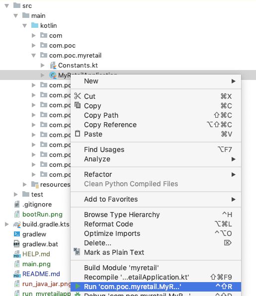
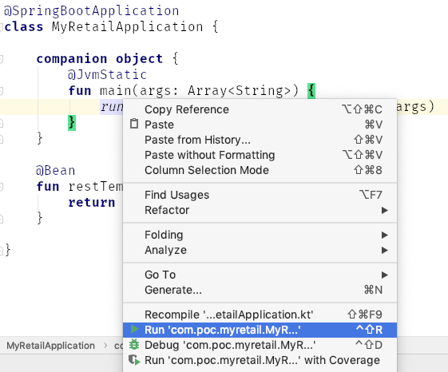
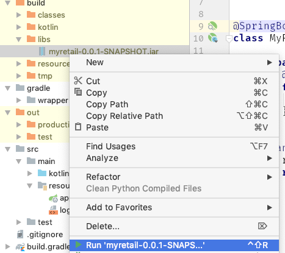
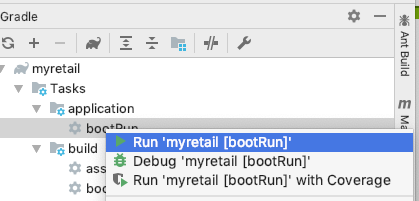
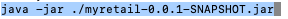
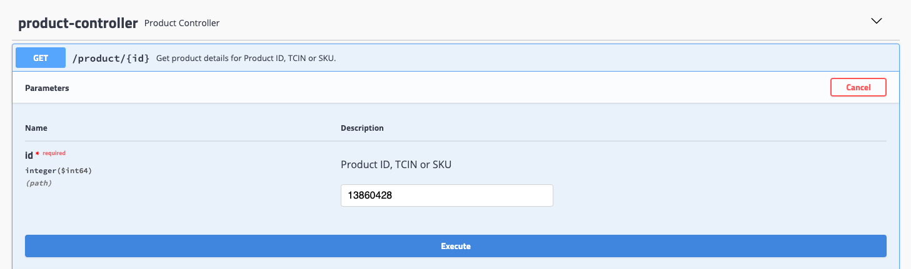
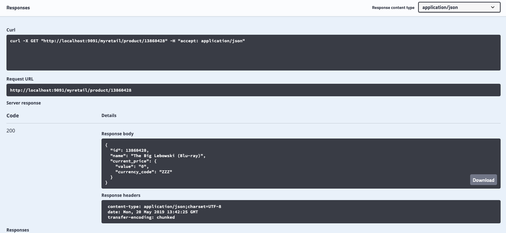
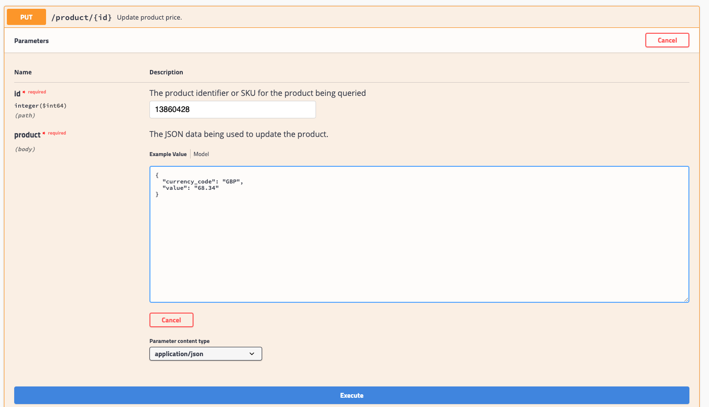
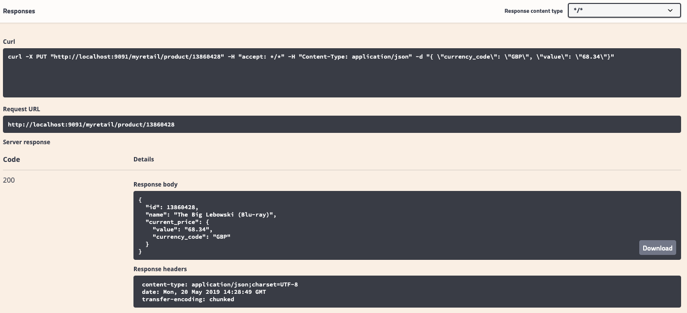
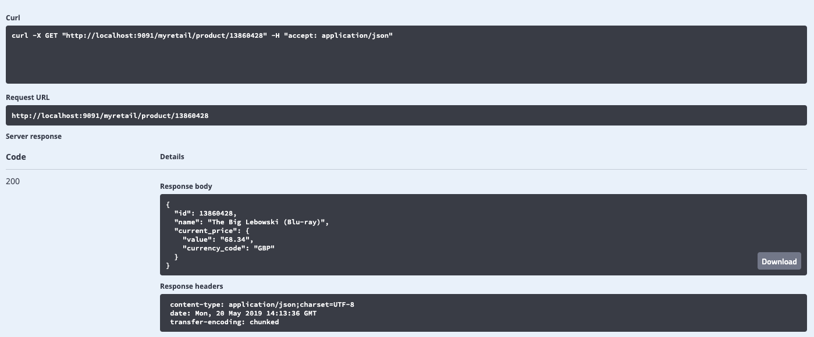

### myRetail RESTful service POC case study ###

myRetail is a rapidly growing company with HQ in Richmond, VA and over 200 stores across the east coast. myRetail wants to make its internal data available to any number of client devices, from myRetail.com to native mobile apps. 

The goal for this exercise is to create an end-to-end Proof-of-Concept for a products API, which will aggregate product data from multiple sources and return it as JSON to the caller. 

Your goal is to create a RESTful service that can retrieve product and price details by ID. The URL structure is up to you to define, but try to follow some sort of logical convention.


Build an application that performs the following actions: 

*	Responds to an HTTP GET request at /products/{id} and delivers product data as JSON (where {id} will be a number). 
*	Example product IDs: 15117729, 16483589, 16696652, 16752456, 15643793. 

*	Example response: {"id":13860428,"name":"The Big Lebowski (Blu-ray) (Widescreen)","current_price":{"value": 13.49,"currency_code":"USD"}}

*	Performs an HTTP GET to retrieve the product name from an external API. (For this exercise the data will come from redsky.target.com, but let’s just pretend this is an internal resource hosted by myRetail) 


*	Example: http://redsky.target.com/v2/pdp/tcin/13860428?excludes=taxonomy,price,promotion,bulk_ship,rating_and_review_reviews,rating_and_review_statistics,question_answer_statistics

*	Reads pricing information from a NoSQL data store and combines it with the product id and name from the HTTP request into a single response. 


*	BONUS: Accepts an HTTP PUT request at the same path (/products/{id}), containing a JSON request body similar to the GET response, and updates the product’s price in the data store. 
 
#### Prerequisites: ####
* Java 8 (and 12)
* Gradle (5.4.1)
* MongoDB (localhost:27017)

#### To run in IntelliJ: ####
* right click on MyRetailApplication in Project View<br/>
  * select: <em>Run 'com.poc.myretail.MyR...'</em><br/>


OR:<br/> 
* open MyRetailApplication file in the editor pane and right click on the **main** method and select <em>Run 'com.poc.myretail.MyR...'</em><br/>


OR:<br/>
* right click on barrenland-1.0-SNAPSHOT.jar in myretail/build/libs directory<br/>
  * select: <em>Run 'myretail-0.0.1-SNAPS...'</em><br/>


OR:<br/>
* from the Gradle view double click on the **bootRun** task or right click and select


##### To run from command line: ##### 
* switch to myretail directory<br/>
* run **./gradlew bootRun**

* OR build the jar file and run java command
  * Mac: <em>./gradlew clean build jar</em><br/>
(Windows - untried: <em>gradlew.bat clean build jar</em>)
  * switch to **myretail/build/libs** directory<br/>
  * run *java -jar ./myretail-0.0.1-SNAPSHOT.jar*



### Test in Browser ###
(A quick test is with a GET, a PUT, a retry of the GET.)
* Open up http://localhost:9091/myretail/swagger-ui.html
* Expand *****product-controller*****
#### GET - step 1 ####
* Click the GET button
* Click the *Try it out* button on the right
* Enter 13860428 [um, it's prefilled] for the ID
* Click *Execute*


* A typical response is shown below

* *0* is the default (empty) price; *ZZZ* is the default (empty) currency code
* 
   ```json
   {
     "id": 13860428,
     "name": "The Big Lebowski (Blu-ray)",
     "current_price": {
       "value": "0",
       "currency_code": "ZZZ"
     }
   }
   ```

#### PUT - step 2 ####

* Click the PUT button 
* Click the *Try it out* button on the right

* Enter 13860428 [um, it's prefilled] for the ID
* Enter something like<br/>
    >{
      "currency_code": "GBP",
      "value": "68.34"
    }
* Click *Execute*
* Example response:

     ```json
     {
        "id": 13860428,
        "name": "The Big Lebowski (Blu-ray)",
        "current_price": {
          "value": "68.34",
          "currency_code": "GBP"
        }
     }
     ```

#### GET - step 3 ####
 * Rerun **step 1**
 * Example response - should match the PUT response:
      ```json
      {
         "id": 13860428,
         "name": "The Big Lebowski (Blu-ray)",
         "current_price": {
           "value": "68.34",
           "currency_code": "GBP"
         }
      }
      ```

